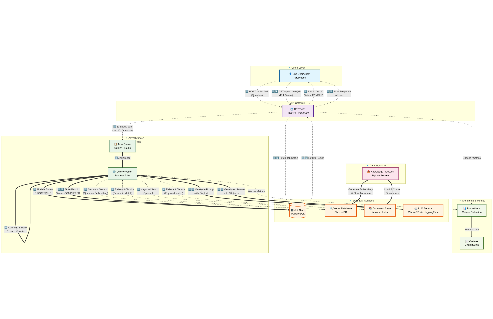

# Technical Knowledge Assistant Microservice

## Project Overview

The Technical Knowledge Assistant is a microservice designed to provide intelligent answers to natural-language questions based on a corpus of engineering and architectural documentation. It leverages a Retrieval Augmented Generation (RAG) pipeline, combining semantic search with Large Language Models (LLMs) to deliver accurate and contextually relevant information. This system is built with scalability, durability, and observability in mind, making it suitable for enterprise environments.

## Proposal Diagram


## Table of Contents

1.  [Architecture Overview](#architecture-overview)
2.  [Core Requirements Met](#core-requirements-met)
3.  [Technical Requirements & Implementation Choices](#technical-requirements--implementation-choices)
4.  [Folder Structure](#folder-structure)
5.  [Setup and Deployment](#setup-and-deployment)
    * [Prerequisites](#prerequisites)
    * [Environment Configuration](#environment-configuration)
    * [Running the Application with Docker Compose](#running-with-docker-compose)
    * [Data Ingestion](#data-ingestion)
6.  [API Endpoints](#api-endpoints)
7.  [Testing](#testing)
8.  [Observability](#observability)
9.  [Production Readiness & Considerations](#production-readiness--considerations)
    * [Scalability](#scalability)
    * [Durability & Reliability](#durability--reliability)
    * [Cost Optimization](#cost-optimization)
    * [Security](#security)
    * [Future Enhancements](#future-enhancements)
10. [Development Notes](#development-notes)

## Architecture Overview

The system is designed as a distributed application composed of several key microservices and components, orchestrated using Docker Compose for ease of development and deployment:

1.  **REST API (FastAPI):** The user-facing component that handles incoming questions via a `POST /api/v1/ask` endpoint and provides job status/results via `GET /api/v1/ask/{job_id}`.
2.  **Task Queue (Celery & Redis):** Manages asynchronous processing of questions. The API places new questions onto the queue, and workers pick them up. Redis serves as the message broker and can also be used as a results backend.
3.  **Worker (Celery):** One or more worker processes that consume tasks from the queue. Each task involves:
    * **Retrieval Layer:** Performing a hybrid search (semantic search via Vector DB and potentially keyword search) to find relevant document chunks.
    * **Generation Layer:** Using the retrieved chunks as context for a Large Language Model (LLM) to generate a comprehensive answer.
4.  **Job Store (PostgreSQL):** A relational database to store job details, including the question, status (PENDING, PROCESSING, COMPLETED, FAILED), the final answer, and source citations. This ensures persistence across restarts.
5.  **Vector Database (ChromaDB):** Stores vector embeddings of the document chunks, enabling efficient semantic similarity searches.
6.  **Knowledge Ingestion Service (Python Script):** A separate process responsible for loading documents (e.g., from `rahular/simple-wikipedia`), splitting them into manageable chunks, generating embeddings, and populating the Vector Database and Document Store.
7.  **LLM Service (Hugging Face Transformers):** Utilizes a pre-trained LLM (e.g., Mistral-7B-Instruct) loaded via the Hugging Face Transformers library for answer generation.
8.  **Observability Stack (Prometheus & Grafana):**
    * **Prometheus:** Scrapes metrics exposed by the API and potentially workers.
    * **Grafana:** Visualizes metrics from Prometheus, providing dashboards for monitoring system health and performance.

## Architecture Diagram



## API Sequence Diagram


## Core Requirements Met

* **Asynchronous Job Processing**: `POST /api/v1/ask` returns a job ID immediately; results are polled via `GET /api/v1/ask/{id}`.
* **Hybrid Search**: Semantic search via VectorDB (ChromaDB) is implemented. Keyword search capabilities can be integrated into the `HybridRetriever`.
* **Grounded, Citable Answers**: LLM (Mistral-7B-Instruct) generates answers based on retrieved context. Source metadata (document ID, chunk ID, URL) is included in the response.
* **Polling Endpoints**: `GET /api/v1/ask/{id}` provides job status and results.
* **Durability**:
    * Job queue (Redis) with appropriate persistence settings.
    * Job store (PostgreSQL) ensures data integrity and recovery.
* **Cost/Performance Considerations**: Utilizes open-source components. Performance metrics are planned for monitoring.

## Technical Requirements & Implementation Choices

* **Running with Docker Compose:**
    * **Step-by-step:**
        1.  **Clone the Repository:** `git clone https://github.com/balavenkatesh3322/technical_knowledge_assistant.git`
        2.  **Navigate to Project Directory:** `cd technical-knowledge-assistant`
        3.  **Create and Configure `.env` file:** update `.env` with your specific configurations (especially if not using defaults for ports or needing a Hugging Face token).
        4.  **Build Docker Images:** `docker-compose build` (Explain that this might take some time initially, especially for downloading base images and models).
        5.  **Start Services:** `docker-compose up -d` (Explain `-d` for detached mode).
        6.  **Verify Services are Running:**
            * `docker-compose ps` to check the status of all containers.
            * `docker-compose logs -f api` or `docker-compose logs -f worker` to tail logs and check for errors.
        7.  **Data Ingestion (Crucial Prerequisite for Functionality):** Emphasize that this step is necessary before asking questions.
            * `docker-compose run --rm ingestion`
            * Mention that this might take a while depending on the dataset size.
            * Optional: How to check if ingestion was successful (e.g., vector DB logs, count of items).
        8.  **Accessing the Application:**
            * API: `http://localhost:8080/docs` (or the port specified in `.env`).
            * Grafana: `http://localhost:3000` (default credentials: admin/password).
            * (If you had a UI, you'd list it here).
        9.  **Stopping the Application:** `docker-compose down` (add `-v` if they want to remove volumes, but caution them about data loss).

* **Data Ingestion:**
    * Reiterate the command: `docker-compose run --rm ingestion`.
    * Mention that this is a one-time setup step (or can be re-run if the source data changes).
    * Briefly explain what it does (loads Wikipedia, chunks, embeds, stores).

**4. API Endpoints:**

* **Clarity on Base URL:** Explicitly state the base URL (e.g., `http://localhost:8080/api/v1` if using the provided `docker-compose.yml` and default port).
* **Example `curl` commands:** The assessment provides examples. Including them here would be very helpful for quick testing.
    * **POST /ask:**
        ```bash
        curl -X POST "http://localhost:8080/api/v1/ask" \
             -H "Content-Type: application/json" \
             -d '{"question": "What are the structural requirements for high-rise buildings in seismic zones?"}'
        ```
        Expected Response:
        ```json
        {
          "job_id": "some-unique-id",
          "status": "PENDING",
          "message": "Job accepted and queued for processing."
        }
        ```
    * **GET /ask/{job_id}:**
        ```bash
        curl "http://localhost:8080/api/v1/ask/{job_id}"
        ```
        Expected Response (initially):
        ```json
        {
          "id": "some-unique-id",
          "question": "What are the structural requirements for high-rise buildings in seismic zones?",
          "status": "PENDING", // or PROCESSING
          "created_at": "YYYY-MM-DDTHH:MM:SS.ffffff",
          "updated_at": "YYYY-MM-DDTHH:MM:SS.ffffff",
          "result_text": null,
          "sources_metadata": null,
          "processing_time_seconds": null
        }
        ```
        Expected Response (after completion):
        ```json
        {
          "id": "some-unique-id",
          "question": "What are the structural requirements for high-rise buildings in seismic zones?",
          "status": "COMPLETED",
          "created_at": "YYYY-MM-DDTHH:MM:SS.ffffff",
          "updated_at": "YYYY-MM-DDTHH:MM:SS.ffffff",
          "result_text": "The answer based on the provided documents...",
          "sources_metadata": [
            {"source_id": "doc_A", "chunk_id": "chunk_1", "relevance_score": 0.85, "url": "[http://example.com/doc_A](http://example.com/doc_A)"}
          ],
          "processing_time_seconds": 15.75
        }
        ```
* **Health Check Endpoint:**
    * `GET /health`
        ```bash
        curl http://localhost:8080/health
        ```
        Expected Response:
        ```json
        {
          "api_status": {
            "status": "ok",
            "message": "API is running"
          },
          "services": {
            "database": "healthy"
          }
        }
        ```

**5. Testing & CI:**

* Mention how to run tests if you've set them up (e.g., `docker-compose run --rm api pytest` or similar for worker tests).
* Briefly describe the CI pipeline if one is configured (e.g., "CI pipeline on GitHub Actions runs linters and unit tests on every push/PR.").

**6. Observability:**

* **Prometheus:** "Metrics are exposed at `/metrics` on the API service (default: `http://localhost:8080/metrics`)."
* **Grafana:** "A pre-configured Grafana instance is available at `http://localhost:3000` (default credentials: admin/password). A basic dashboard can be imported/created to visualize key metrics." (If you have a dashboard JSON, mention how to import it).

**7. Production Readiness & Considerations:**

* **LLM Model Choice:** Reiterate that `Mistral-7B-Instruct` is used and discuss potential for using quantized versions (GPTQ, GGUF) or more optimized serving solutions (TGI, vLLM) for better performance and resource efficiency in production.
* **Database Scaling:** Mention that PostgreSQL can be scaled (read replicas, etc.) and Redis can be clustered.
* **Worker Scaling:** Explain that Celery workers can be scaled horizontally by increasing the number of replicas in `docker-compose.yml` or a Kubernetes deployment.
* **Error Handling & Retries:** Briefly mention the retry mechanisms implemented in Celery tasks.

**8. Development Notes:**

* **Model Downloading:** "The first time the worker or ingestion service runs, it may take a significant amount of time to download the LLM and embedding models from Hugging Face Hub. Subsequent runs will use the cached models (ensure Docker volumes are used for persistence if running locally outside of a single `docker-compose up` session)."
* **Resource Requirements:** "Running the full stack, especially the LLM, can be resource-intensive. Ensure your Docker environment has sufficient RAM (e.g., 16GB+ recommended for Mistral-7B) and CPU. For GPU acceleration, ensure your Docker setup and NVIDIA drivers are correctly configured."

