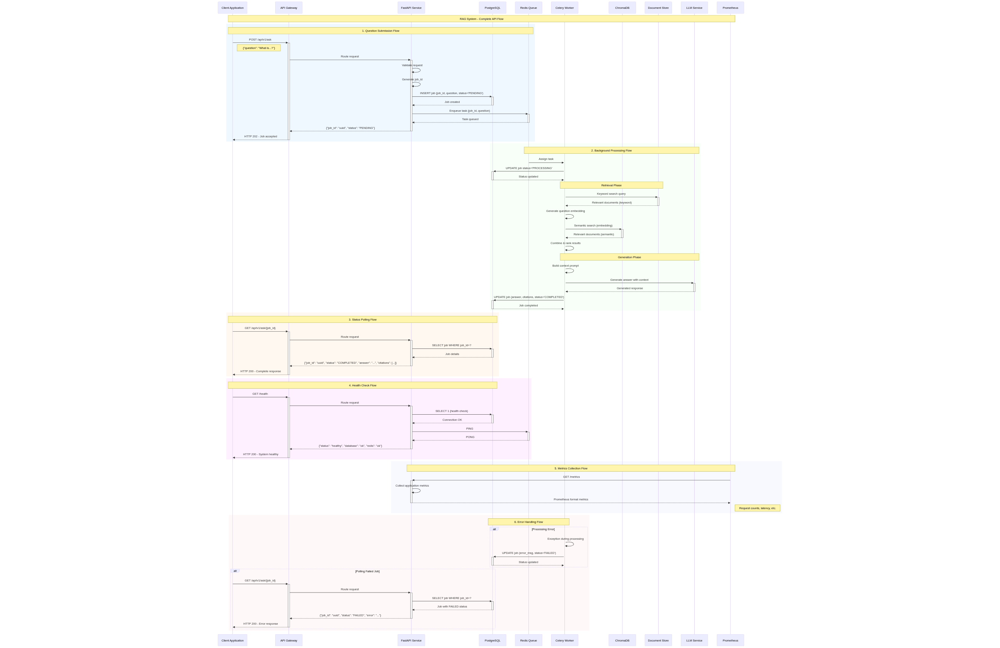

# API Service Documentation

## Overview
This document provides an explanation of the API architecture, detailing the components, their interactions, and the flow of requests through the system.

## Architecture Diagram Explanation

### Components

#### User/Client
- **Description**: The entity initiating requests to the API, such as a web frontend, mobile app, or curl commands.

#### API Gateway (Conceptual)
- **Description**: In a production environment, an API Gateway (e.g., Nginx, HAProxy, or a cloud provider's service) would handle load balancing, SSL termination, advanced rate limiting, and authentication. Note: Not explicitly implemented in this simple setup.

#### API Service (FastAPI)
- **Description**: The core service handling RESTful API requests.
- **Endpoints**:
  - `POST /api/v1/ask`: Submits a new question/task.
  - `GET /api/v1/ask/{id}`: Retrieves the status or results of a specific job by ID.
  - `GET /metrics`: Exposes metrics for Prometheus monitoring.
  - `GET /health`: Checks connectivity to critical services (e.g., database).
- **Internal Logic**:
  - **Request Validation**: Ensures incoming data is correctly formatted and contains required information.
  - **Job ID Generation**: Creates a unique identifier for each new task.
  - **Database Interaction**: Communicates with the PostgreSQL JobStore to create job entries and retrieve job status/results.
  - **Task Enqueueing**: Pushes tasks (question and job ID) to the Celery task queue (Redis).
  - **Metrics Collection**: Gathers and exposes metrics for Prometheus.

#### Backend Services
- **JobDB (PostgreSQL)**:
  - Stores persistent data related to jobs, such as job IDs, statuses, and results.
- **TaskQueue (Redis)**:
  - Acts as the message broker for Celery tasks, queuing tasks for processing.
- **Prometheus Server**:
  - Scrapes the `/metrics` endpoint of the API to collect and monitor performance metrics.

### Request Flow
1. **User Request**: A user sends a request to an API endpoint (e.g., `POST /api/v1/ask`).
2. **Request Validation**: The API validates the incoming request for correct format and required data.
3. **Task Processing** (for `/ask`):
   - A unique job ID is generated.
   - A new job entry is created in the JobDB (PostgreSQL).
   - The task (question and job ID) is enqueued in the TaskQueue (Redis).
4. **API Response**:
   - For `POST /api/v1/ask`, the API returns the job ID.
   - For `GET /api/v1/ask/{id}`, the API returns job details (status/results) from the JobDB.
5. **Monitoring**:
   - The `/metrics` endpoint is periodically scraped by the Prometheus server.
   - The `/health` endpoint checks connectivity to critical services like the database.

## API Sequence Diagram

### Mermaid code

