# System Architecture Overview

This document provides an overview of the system architecture, detailing the components and their interactions for processing user queries, handling asynchronous tasks, and managing data and monitoring.

## System Balance

### User Interaction
- **Client Application**: Users initiate requests through a client application, sending questions to the system.

### API Layer
- **FastAPI Application**: Acts as the entry point for user requests.
  - Handles incoming requests and validates input.
  - Creates job entries in the database.
  - Enqueues tasks for asynchronous processing.

### Asynchronous Processing
- **Task Queue (Celery + Redis)**:
  - Decouples the API from time-consuming processing tasks.
  - Redis serves as the message broker for task queuing.
- **Celery Worker**:
  - Consumes tasks from the Redis queue.
  - Executes the core processing logic.

### Data & Model Layer
- **Job Store (PostgreSQL)**:
  - Persists job information, including status, question, answer, and metadata.
- **Vector Database (ChromaDB)**:
  - Stores embeddings of document chunks for efficient semantic search.
- **Document Store / Keyword Index**:
  - Stores raw text chunks and metadata for keyword-based searches.
  - Can leverage PostgreSQL's full-text search or a dedicated system like Elasticsearch.
- **LLM Service (Hugging Face Transformers)**:
  - Utilizes a pre-trained language model (Mistral-7B) to generate answers based on retrieved context.

### Offline Processes
- **Knowledge Ingestion Service**:
  - Processes source documents by chunking them and generating embeddings.
  - Populates the Vector Database (ChromaDB) and Document Store with processed data.

### Monitoring
- **Prometheus**:
  - Collects metrics from the API and optionally from workers.
- **Grafana**:
  - Visualizes system metrics for monitoring health and performance.

## Workflow

1. **User Request**:
   - A user submits a question to the `/api/v1/ask` endpoint.
2. **API Processing**:
   - The FastAPI service creates a job entry in PostgreSQL with a `PENDING` status.
   - The job (question and job ID) is enqueued in the Redis task queue.
   - The API responds to the user with the `job_id` and `PENDING` status.
3. **Task Processing**:
   - A Celery worker retrieves the job from the Redis queue.
   - The worker updates the job status to `PROCESSING` in PostgreSQL.
4. **Retrieval Layer**:
   - **Semantic Search**: Generates an embedding for the question and queries ChromaDB to find semantically similar document chunks.
   - **Keyword Search**: Queries the Document Store for chunks matching keywords (conceptual).
   - Combines and ranks results to select the top-K relevant passages.
5. **Generation Layer**:
   - Constructs a prompt using the original question and retrieved passages.
   - Sends the prompt to the LLM (Mistral-7B via Hugging Face Transformers).
   - The LLM generates an answer.
6. **Job Completion**:
   - The worker updates the PostgreSQL job entry with the generated answer and source citations (from passage metadata).
   - Sets the job status to `COMPLETED` or `FAILED` if an error occurs.
7. **User Retrieval**:
   - The user polls the `GET /api/v1/ask/{job_id}` endpoint to check the job status and retrieve the answer once `COMPLETED`.
8. **Offline Knowledge Ingestion**:
   - The Knowledge Ingestion Service processes source documents, chunks them, generates embeddings, and populates ChromaDB and the Document Store.
9. **Monitoring**:
   - Prometheus scrapes metrics from the API and workers.
   - Grafana visualizes these metrics for system health and performance monitoring.

## Purpose
This architecture ensures efficient handling of user queries through asynchronous processing, robust data management, and comprehensive monitoring. It supports scalable and reliable question-answering capabilities with semantic and keyword search integration.

## Architecture Diagram

### Mermaid code

```mermaid
---
config:
  layout: fixed
---
flowchart TD
 subgraph UL["🔹 Client Layer"]
        User["👤 End User/Client Application"]
  end
 subgraph AL["🔹 API Gateway"]
        API["🌐 REST API<br>FastAPI - Port 8080"]
  end
 subgraph PL["🔹 Asynchronous Processing"]
        TaskQueue["📋 Task Queue<br>Celery + Redis"]
        Worker["⚙️ Celery Worker<br>Process Jobs"]
  end
 subgraph DL["🔹 Data & AI Services"]
        JobDB[("🗄️ Job Store<br>PostgreSQL")]
        VectorDB["🔍 Vector Database<br>ChromaDB"]
        DocStore["📚 Document Store<br>Keyword Index"]
        LLM["🤖 LLM Service<br>Mistral-7B via HuggingFace"]
  end
 subgraph IL["🔹 Data Ingestion"]
        IngestionService["📥 Knowledge Ingestion<br>Python Service"]
  end
 subgraph ML["🔹 Monitoring & Metrics"]
        Prometheus["📊 Prometheus<br>Metrics Collection"]
        Grafana["📈 Grafana<br>Visualization"]
  end
    User -. 1️⃣ POST /api/v1/ask<br>(Question) .-> API
    API -. 2️⃣ Enqueue Job<br>(Job ID, Question) .-> TaskQueue
    API -. 3️⃣ Return Job ID<br>Status: PENDING .-> User
    TaskQueue == 4️⃣ Assign Job ==> Worker
    Worker == 5️⃣ Update Status<br>PROCESSING ==> JobDB
    Worker -. 6️⃣ Keyword Search<br>(Optional) .-> DocStore
    Worker -. 7️⃣ Semantic Search<br>(Question Embedding) .-> VectorDB
    DocStore -. 8️⃣ Relevant Chunks<br>(Keyword Match) .-> Worker
    VectorDB -. 9️⃣ Relevant Chunks<br>(Semantic Match) .-> Worker
    Worker == 🔟 Combine &amp; Rank<br>Context Chunks ==> Worker
    Worker == 1️⃣1️⃣ Generate Prompt<br>with Context ==> LLM
    LLM == 1️⃣2️⃣ Generated Answer<br>with Citations ==> Worker
    Worker == 1️⃣3️⃣ Store Result<br>Status: COMPLETED ==> JobDB
    User -. 1️⃣4️⃣ GET /api/v1/ask/{id}<br>(Poll Status) .-> API
    API -. 1️⃣5️⃣ Fetch Job Status .-> JobDB
    JobDB -. 1️⃣6️⃣ Return Result .-> API
    API -. 1️⃣7️⃣ Final Response<br>to User .-> User
    IngestionService == Load &amp; Chunk<br>Documents ==> DocStore
    IngestionService == Generate Embeddings<br>&amp; Store Metadata ==> VectorDB
    API -. Expose /metrics .-> Prometheus
    Worker -. Worker Metrics .-> Prometheus
    Prometheus == Metrics Data ==> Grafana
     User:::userStyle
     API:::apiStyle
     TaskQueue:::workerStyle
     Worker:::workerStyle
     JobDB:::dataStyle
     VectorDB:::dataStyle
     DocStore:::dataStyle
     LLM:::dataStyle
     IngestionService:::ingestionStyle
     Prometheus:::monitoringStyle
     Grafana:::monitoringStyle
    classDef userStyle fill:#e1f5fe,stroke:#01579b,stroke-width:2px,color:#000
    classDef apiStyle fill:#f3e5f5,stroke:#4a148c,stroke-width:2px,color:#000
    classDef workerStyle fill:#e8f5e8,stroke:#1b5e20,stroke-width:2px,color:#000
    classDef dataStyle fill:#fff3e0,stroke:#e65100,stroke-width:2px,color:#000
    classDef ingestionStyle fill:#fce4ec,stroke:#880e4f,stroke-width:2px,color:#000
    classDef monitoringStyle fill:#f1f8e9,stroke:#33691e,stroke-width:2px,color:#000
    classDef subgraphStyle fill:#fafafa,stroke:#424242,stroke-width:1px
```

