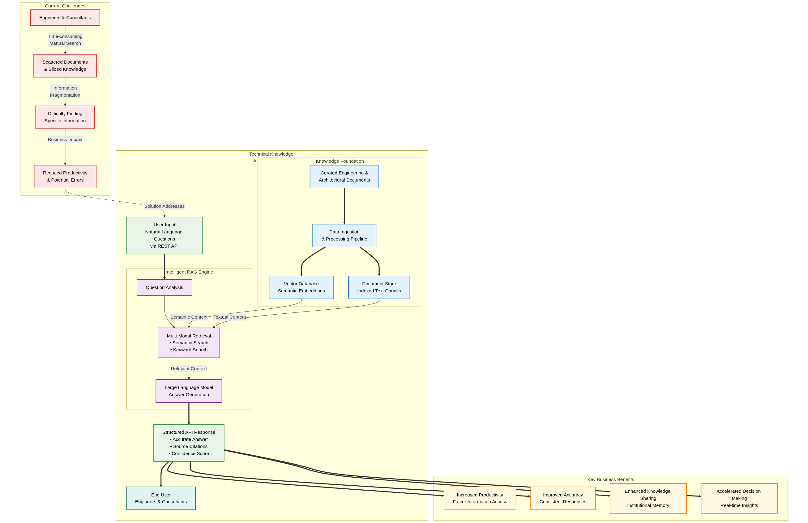

# Project Proposal: Technical Knowledge Assistant
## Revolutionizing Knowledge Access and Efficiency at Ramboll

**Prepared For**: Ramboll Stakeholders  
**Prepared By**: Bala venkatesh S

**Date**: June 5, 2025

## Proposal Diagram

## 1. The Challenge: Unlocking Trapped Knowledge
Ramboll's engineers and consultants require rapid access to technical standards, best practices, project histories, and regulatory information. Current challenges include:

- **Time-Consuming Searches**: Manually navigating document libraries or relying on colleagues wastes valuable engineering hours.
- **Inefficient Processes**: Scattered information across systems hinders comprehensive research.
- **Inconsistencies**: Varied interpretations of data can lead to inconsistent project execution.
- **Onboarding Barriers**: New team members struggle with navigating complex knowledge bases.

This "knowledge retrieval gap" slows project timelines, reduces efficiency, and risks inconsistent application of best practices.

## 2. Our Solution: Technical Knowledge Assistant
The Technical Knowledge Assistant is an AI-powered microservice delivering rapid, accurate, and contextually relevant answers to technical queries from Ramboll’s documentation, using natural language processing.

## 3. How It Works: Retrieval Augmented Generation (RAG)
The system leverages **Retrieval Augmented Generation (RAG)** for accurate, sourced answers:

1. **Knowledge Ingestion**: Processes documents (e.g., Ramboll’s internal corpus) into chunks, indexed in a Vector Database for efficient search.
2. **User Query**: Engineers ask questions in natural language (e.g., "What are seismic design considerations for steel structures in Zone 4?").
3. **Intelligent Retrieval**: Searches the Vector Database for relevant document passages.
4. **Contextual Generation**: A Large Language Model (LLM) generates a concise answer using retrieved passages.
5. **Cited Answers**: Provides responses with source citations for verification.

### Why RAG?
- **Reduces Hallucinations**: Grounds answers in trusted documents, ensuring accuracy.
- **Up-to-Date Information**: Reflects the latest documents without retraining the LLM.
- **Transparency**: Citations build trust and enable further exploration.
- **Cost-Effective**: Leverages pre-trained LLMs, avoiding costly custom training.

## 4. Key Benefits & Value Proposition
The Assistant delivers significant value to Ramboll:

- **Reduced Search Time**:
  - **User Value**: Answers in seconds, freeing time for core engineering tasks.
  - **Business Impact**: Boosts productivity and speeds up project delivery.
- **Improved Accuracy & Consistency**:
  - **User Value**: Verified, sourced answers reduce errors.
  - **Business Impact**: Enhances deliverable quality, reduces rework, ensures compliance.
- **Enhanced Knowledge Management**:
  - **User Value**: Democratizes access to expertise for all engineers.
  - **Business Impact**: Prevents knowledge loss, improves collaboration, ensures best practices.
- **Accelerated Onboarding**:
  - **User Value**: New hires quickly learn procedures, reducing reliance on seniors.
  - **Business Impact**: Lowers training costs, frees senior staff.
- **Faster Decision-Making**:
  - **User Value**: Timely, accurate information supports confident decisions.
  - **Business Impact**: Improves project outcomes and client responsiveness.
- **Fostering Innovation**:
  - **User Value**: Easy access to knowledge sparks new ideas.
  - **Business Impact**: Drives new solutions and competitive methodologies.

## 5. Use Cases & User Scenarios
The Assistant supports key tasks:

- **Finding Standards**: "What is the fire resistance rating for steel columns in Type VB construction?" → Cites specific standards.
- **Understanding Principles**: "Explain tuned mass dampers for tall buildings." → Summarizes technical guides.
- **Past Project Insights**: "What were soil stabilization challenges in the City Center tower project?" → Summarizes project reports.
- **Regulatory Compliance**: "What are California’s stormwater runoff regulations?" → Summarizes relevant regulations.
- **Troubleshooting**: "What causes HVAC system vibrations and remedies?" → Lists solutions from case studies.
- **Material Comparisons**: "Compare A36 vs. A572 Grade 50 steel tensile strength." → Extracts data from specs.

### Time Savings with RAG
- **Targeted Retrieval**: Pinpoints relevant document sections.
- **Synthesized Answers**: Delivers concise responses, reducing manual reading.
- **Citations**: Enables quick access to sources for deeper exploration.

## 6. Technical Foundation
- **Backend**: Python with FastAPI (high-performance APIs), Celery (asynchronous tasks).
- **Data Storage**: PostgreSQL (job data), Redis (caching, queuing).
- **AI/ML**: Hugging Face Transformers (LLM, e.g., Mistral-7B), Sentence Transformers (embeddings), ChromaDB (vector database).
- **Deployment**: Docker/Docker Compose for consistent, scalable deployment.
- **Observability**: Prometheus and Grafana for performance monitoring.

## 7. Upcoming Features
- **Rich User Interface (UI)**:
  - Web-based UI using React and Tailwind CSS for a responsive, intuitive experience.
  - Dashboard for querying, viewing results, and managing data with drag-and-drop uploads.
  - Real-time query status and exportable results (PDF, CSV).
- **Data Ingestion via UI**:
  - Upload documents (PDFs, DOCX, CAD metadata) with metadata tagging.
  - Bulk upload and real-time validation for efficient ingestion.
- **API Access from UI**:
  - Visual query builder for API endpoints (`POST /api/v1/ask`, `GET /api/v1/ask/{id}`).
  - Displays formatted answers, citations, and job status.
- **Authentication & Authorization**:
  - SSO integration (Azure AD, Okta) with multi-factor authentication (MFA).
  - Role-based access control for secure data access.
- **Advanced Search & Filtering**:
  - Autocomplete search and filters (document type, date, project).
  - Saved searches for recurring queries.
- **Collaboration Features**:
  - Commenting and sharing results via Teams/Slack.
  - Links to query results or documents.
- **Analytics Dashboard**:
  - Tracks usage, query trends, and system performance.
  - Admin view for ingestion monitoring and ROI reporting.
- **Offline Support**: Cached results and PWA capabilities for mobile access.

## 8. Proposed Roadmap
- **Phase 1: Proof of Concept Refinement**:
  - Finalize core functionality with test dataset (e.g., simple-wikipedia).
  - Internal pilot with small engineer group, gather feedback.
  - Refine ingestion for Ramboll document formats.
- **Phase 2: Integration & Extended Pilot**:
  - Connect to Ramboll’s document repositories.
  - Ingest curated internal documents.
  - Expand pilot, develop user documentation.
- **Phase 3: Production Rollout**:
  - Deploy with scalability, security, and high availability.
  - Integrate with workflows (Intranet, Teams).
  - Monitor performance, update knowledge base, explore LLM fine-tuning.

## 9. Call to Action
The Technical Knowledge Assistant will transform how Ramboll’s engineers access information, driving productivity, quality, and innovation. We seek your support to advance development, deploy the system, and realize its full potential. Contact us to discuss, demo the prototype, or address questions.