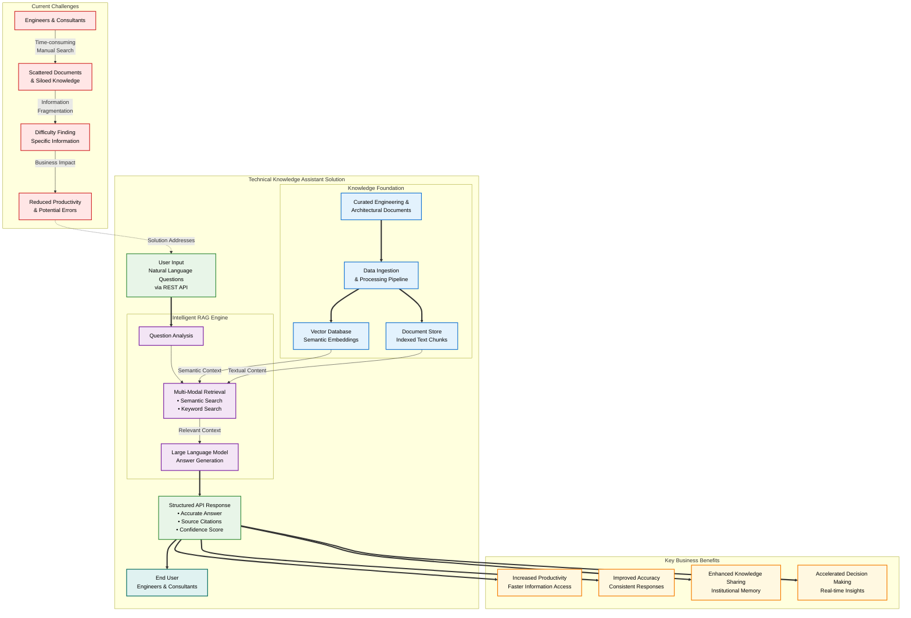

### Mermaid code

```mermaid
graph TD
    %% Current State - Problems
    subgraph PS[" Current Challenges "]
        A["Engineers & Consultants"]
        B["Scattered Documents<br/>& Siloed Knowledge"]
        C["Difficulty Finding<br/>Specific Information"]
        D["Reduced Productivity<br/>& Potential Errors"]
        
        A -->|"Time-consuming<br/>Manual Search"| B
        B -->|"Information<br/>Fragmentation"| C
        C -->|"Business Impact"| D
    end

    %% Solution Architecture
    subgraph SA[" Technical Knowledge Assistant Solution "]
        %% Input Layer
        UserInput["User Input<br/>Natural Language Questions<br/>via REST API"]
        
        %% Knowledge Layer
        subgraph KL[" Knowledge Foundation "]
            KnowledgeBase["Curated Engineering &<br/>Architectural Documents"]
            Ingestion["Data Ingestion<br/>& Processing Pipeline"]
            VectorDB["Vector Database<br/>Semantic Embeddings"]
            DocStore["Document Store<br/>Indexed Text Chunks"]
        end
        
        %% Processing Engine
        subgraph PE[" Intelligent RAG Engine "]
            UserQuestion["Question Analysis"]
            Retriever["Multi-Modal Retrieval<br/>• Semantic Search<br/>• Keyword Search"]
            LLM["Large Language Model<br/>Answer Generation"]
            
            UserQuestion --> Retriever
            Retriever -->|"Relevant Context"| LLM
        end
        
        %% Output
        APIResponse["Structured API Response<br/>• Accurate Answer<br/>• Source Citations<br/>• Confidence Score"]
        User["End User<br/>Engineers & Consultants"]
    end

    %% Business Value
    subgraph BV[" Key Business Benefits "]
        Benefit1["Increased Productivity<br/>Faster Information Access"]
        Benefit2["Improved Accuracy<br/>Consistent Responses"]
        Benefit3["Enhanced Knowledge Sharing<br/>Institutional Memory"]
        Benefit4["Accelerated Decision Making<br/>Real-time Insights"]
    end

    %% Main Flow Connections
    D -.->|"Solution Addresses"| UserInput
    
    %% Knowledge Processing Flow
    KnowledgeBase ==> Ingestion
    Ingestion ==> VectorDB
    Ingestion ==> DocStore
    
    %% Query Processing Flow
    UserInput ==> UserQuestion
    VectorDB -->|"Semantic Context"| Retriever
    DocStore -->|"Textual Content"| Retriever
    LLM ==> APIResponse
    APIResponse ==> User
    
    %% Business Value Flow
    APIResponse ==> Benefit1
    APIResponse ==> Benefit2
    APIResponse ==> Benefit3
    APIResponse ==> Benefit4

    %% Styling
    classDef problemStyle fill:#ffe6e6,stroke:#d32f2f,stroke-width:2px,color:#000
    classDef solutionStyle fill:#e8f5e8,stroke:#388e3c,stroke-width:2px,color:#000
    classDef knowledgeStyle fill:#e3f2fd,stroke:#1976d2,stroke-width:2px,color:#000
    classDef processingStyle fill:#f3e5f5,stroke:#7b1fa2,stroke-width:2px,color:#000
    classDef benefitStyle fill:#fff8e1,stroke:#f57c00,stroke-width:2px,color:#000
    classDef userStyle fill:#e0f2f1,stroke:#00695c,stroke-width:2px,color:#000
    classDef subgraphStyle fill:#fafafa,stroke:#757575,stroke-width:1px

    %% Apply Styles
    class A,B,C,D problemStyle
    class UserInput,APIResponse solutionStyle
    class KnowledgeBase,Ingestion,VectorDB,DocStore knowledgeStyle
    class UserQuestion,Retriever,LLM processingStyle
    class Benefit1,Benefit2,Benefit3,Benefit4 benefitStyle
    class User userStyle
```