# Technical Knowledge Assistant: Development Roadmap & Team Guide

## 1. Project Vision & Goals
**Vision**: Create a reliable, efficient AI-powered knowledge assistant indispensable for Ramboll engineers and consultants.

**Core Goals**:
- **Accelerate Information Discovery**: Reduce time spent searching for technical information.
- **Improve Project Accuracy**: Ensure decisions use current internal standards and documentation.
- **Democratize Knowledge**: Make Ramboll’s collective knowledge accessible to all.
- **Enhance Productivity**: Free up engineering time for high-impact tasks.

## Roadmap Diagram

## 2. Current State: MVP Complete (June 2025)
The Minimum Viable Product (MVP) is complete, demonstrating core functionality and a foundation for future development.

**Completed Features**:
- **Asynchronous Architecture**: FastAPI, Celery, and Redis ensure responsive API under load.
- **Durable Job Storage**: PostgreSQL tracks query lifecycles, ensuring no lost requests.
- **Basic Ingestion Pipeline**: Loads rahular/simple-wikipedia dataset, chunks documents, generates embeddings (sentence-transformers), and stores in ChromaDB.
- **Semantic Retrieval**: Retrieves relevant document chunks based on semantic similarity.
- **LLM-Powered Generation**: Uses Mistral-7B-Instruct to synthesize answers.
- **API Endpoints**: POST `/api/v1/ask` for questions, GET `/api/v1/ask/{id}` for results.
- **Containerized Deployment**: Dockerized stack launches with `docker-compose up`.
- **Basic Observability**: Includes `/metrics` (Prometheus) and `/health` endpoints.

## 3. Team Roles & Responsibilities
- **Lead ML Engineer (Tech Lead)**: Owns architecture, RAG pipeline, model selection, and technical direction.
- **Backend Developer(s)**: Manages FastAPI, Celery tasks, database schema, and integrations.
- **MLOps/DevOps Engineer**: Handles CI/CD, infrastructure, monitoring, and deployment.
- **QA Engineer**: Develops unit, integration, and end-to-end tests for functionality and RAG quality.
- **Product Manager/Owner**: Gathers feedback, prioritizes features, and defines success metrics.

## 4. Development Roadmap

### Phase 1: Stabilization & Hardening (Next 2-4 Sprints | ~1-2 Months)
**Goal**: Transition MVP to a robust, secure service for a controlled pilot.

| Feature/Task | Priority | Owner Role(s) | Description & Success Metrics |
|--------------|----------|---------------|------------------------------|
| Comprehensive Test Suite | High | Backend, QA | Full unit test coverage for core logic and API-Celery-DB flow. Metric: Code coverage > 85%. |
| Full Hybrid Search | High | Backend, Lead ML | Integrate keyword search (e.g., PostgreSQL Full-Text Search) and re-ranking (e.g., RRF) for better retrieval. |
| Enhanced Logging & Tracing | High | DevOps, Backend | Propagate job_id in logs, set up centralized logging (e.g., ELK stack). |
| Production-Ready Ingestion | Medium | Backend, Lead ML | Support PDF/DOCX, add error handling and progress tracking to ingestion script. |
| Security Hardening | Medium | DevOps, Backend | Add API rate limiting, review dependencies and Docker configs. |

### Phase 2: User Feedback & Enhanced Retrieval (Q3-Q4 2025)
**Goal**: Improve answer quality and user experience with feedback and advanced RAG techniques.

| Feature/Task | Priority | Owner Role(s) | Description & Success Metrics |
|--------------|----------|---------------|------------------------------|
| Controlled Pilot | High | Product, Lead ML | Onboard 5-10 engineers, gather feedback. Metric: User satisfaction > 7/10. |
| User Feedback Mechanism | High | Backend, Product | Add API/UI for rating answers (thumbs up/down) and comments. |
| Advanced Chunking | Medium | Lead ML | Experiment with semantic chunking or proposition-based indexing. |
| Conversational Memory | Medium | Backend, Lead ML | Retain context for follow-up questions. |
| Model Evaluation Framework | Low | Lead ML, QA | Evaluate RAG performance (e.g., context_relevancy, faithfulness). |

### Phase 3: Enterprise Integration & Scaling (Q1-Q2 2026)
**Goal**: Roll out to wider Ramboll audience and integrate with engineering workflows.

| Feature/Task | Priority | Owner Role(s) | Description & Success Metrics |
|--------------|----------|---------------|------------------------------|
| SSO & Authentication | High | Backend, DevOps | Integrate with Ramboll’s identity provider (e.g., Azure AD). |
| Document-Level Access Control | High | Backend, Lead ML | Filter documents by user permissions to protect confidential data. |
| Microsoft Teams/SharePoint Integration | Medium | Backend, Product | Develop bot/plugin for question-asking in collaboration tools. |
| Autoscaling Workers | Medium | DevOps | Deploy on Kubernetes with Horizontal Pod Autoscaling for Celery workers. |

## 5. How to Contribute
- **Branching**: Create feature branches from `main` (e.g., `feature/TKA-123-add-rate-limiting`).
- **Commits**: Use clear, concise commit messages.
- **Pull Requests (PRs)**: Open PRs against `main`, ensure linting, testing, and CI checks pass.
- **Code Reviews**: Require at least one team member approval before merging.

This roadmap outlines a clear path to deliver a high-quality, reliable tool for Ramboll colleagues.

### Mermaid code

```mermaid

graph TD
    %% Current State
    subgraph CS[" Current State - Q2 2025 "]
        MVP["✅ MVP Foundation<br/>• Core RAG Pipeline<br/>• Basic API Endpoints<br/>• PostgreSQL + Redis<br/>• FastAPI Service<br/><b>Status: COMPLETED</b>"]
    end

    %% Phase 1: Foundation Hardening
    subgraph P1[" Phase 1: Foundation Hardening<br/>Q2-Q3 2025 (12 weeks) "]
        P1_Start["🎯 Phase 1 Kickoff<br/>June 9, 2025"]
        P1_Test["🧪 Comprehensive Testing<br/>• Unit & Integration Tests<br/>• Performance Benchmarks<br/>• 4 weeks"]
        P1_Log["📊 Enhanced Monitoring<br/>• Structured Logging<br/>• Distributed Tracing<br/>• 3 weeks"]
        P1_Ingest["📥 Production Ingestion<br/>• PDF/DOCX Processing<br/>• Batch Operations<br/>• 4 weeks"]
        P1_Search["🔍 Hybrid Search<br/>• Semantic + Keyword<br/>• Result Ranking<br/>• 4 weeks"]
        P1_Sec["🔒 Security Hardening<br/>• Rate Limiting<br/>• Input Validation<br/>• 3 weeks"]
        P1_End["✅ Phase 1 Complete<br/>September 2025"]
        
        P1_Start --> P1_Test
        P1_Start --> P1_Log
        P1_Log --> P1_Ingest
        P1_Test --> P1_Search
        P1_Search --> P1_Sec
        P1_Ingest --> P1_End
        P1_Sec --> P1_End
    end

    %% Phase 2: User Experience & AI Enhancement
    subgraph P2[" Phase 2: User Experience & AI Enhancement<br/>Q3-Q4 2025 (20 weeks) "]
        P2_Start["🎯 Phase 2 Kickoff<br/>August 2025"]
        P2_Pilot["👥 Controlled Pilot<br/>• 10-15 Engineers<br/>• Real Use Cases<br/>• 6 weeks"]
        P2_Feedback["💬 Feedback Integration<br/>• User Interface Improvements<br/>• API Enhancements<br/>• 4 weeks"]
        P2_Chunk["🧩 Advanced Chunking<br/>• Smart Document Parsing<br/>• Context Preservation<br/>• 6 weeks"]
        P2_Memory["🧠 Conversational Memory<br/>• Session Management<br/>• Context Tracking<br/>• 6 weeks"]
        P2_Eval["📈 Model Evaluation<br/>• Quality Metrics<br/>• A/B Testing Framework<br/>• 4 weeks"]
        P2_End["✅ Phase 2 Complete<br/>December 2025"]
        
        P2_Start --> P2_Pilot
        P2_Pilot --> P2_Feedback
        P2_Pilot --> P2_Chunk
        P2_Feedback --> P2_Memory
        P2_Chunk --> P2_Eval
        P2_Memory --> P2_End
        P2_Eval --> P2_End
    end

    %% Phase 3: Enterprise Integration
    subgraph P3[" Phase 3: Enterprise Integration<br/>Q1-Q2 2026 (22 weeks) "]
        P3_Start["🎯 Phase 3 Kickoff<br/>January 2026"]
        P3_SSO["🔐 Enterprise Auth<br/>• SSO Integration<br/>• Role-Based Access<br/>• 8 weeks"]
        P3_Access["🛡️ Document Security<br/>• Access Control Lists<br/>• Permission Management<br/>• 6 weeks"]
        P3_Teams["💼 MS Teams Integration<br/>• Bot Interface<br/>• Workflow Integration<br/>• 8 weeks"]
        P3_Share["📂 SharePoint Connector<br/>• Document Sync<br/>• Real-time Updates<br/>• 4 weeks"]
        P3_Scale["☁️ Auto-scaling<br/>• Kubernetes Deployment<br/>• Load Balancing<br/>• 6 weeks"]
        P3_End["✅ Phase 3 Complete<br/>June 2026"]
        
        P3_Start --> P3_SSO
        P3_SSO --> P3_Access
        P3_SSO --> P3_Teams
        P3_Teams --> P3_Share
        P3_Access --> P3_Scale
        P3_Share --> P3_End
        P3_Scale --> P3_End
    end

    %% Phase 4: Advanced Features
    subgraph P4[" Phase 4: Advanced Features<br/>Q2-Q3 2026 (16 weeks) "]
        P4_Start["🎯 Phase 4 Kickoff<br/>June 2026"]
        P4_Analytics["📊 Advanced Analytics<br/>• Usage Dashboards<br/>• Performance Metrics<br/>• 6 weeks"]
        P4_Multi["🌐 Multi-Language Support<br/>• NLP Enhancements<br/>• Localization<br/>• 8 weeks"]
        P4_Citation["📝 Enhanced Citations<br/>• Source Verification<br/>• Reference Management<br/>• 4 weeks"]
        P4_API["⚡ API Optimization<br/>• Rate Limiting<br/>• Quota Management<br/>• 3 weeks"]
        P4_End["✅ Phase 4 Complete<br/>September 2026"]
        
        P4_Start --> P4_Analytics
        P4_Start --> P4_Multi
        P4_Analytics --> P4_Citation
        P4_Multi --> P4_API
        P4_Citation --> P4_End
        P4_API --> P4_End
    end

    %% Production Readiness
    subgraph PR[" Production Excellence<br/>Q4 2026 (12 weeks) "]
        PR_Start["🎯 Production Focus<br/>September 2026"]
        PR_Perf["🚀 Performance Optimization<br/>• Response Time < 2s<br/>• 99.9% Uptime<br/>• 6 weeks"]
        PR_Cost["💰 Cost Optimization<br/>• Resource Efficiency<br/>• Infrastructure Tuning<br/>• 4 weeks"]
        PR_DR["🔄 Disaster Recovery<br/>• Backup Systems<br/>• Failover Procedures<br/>• 6 weeks"]
        PR_Launch["🎉 Enterprise Launch<br/>December 2026"]
        
        PR_Start --> PR_Perf
        PR_Start --> PR_DR
        PR_Perf --> PR_Cost
        PR_DR --> PR_Launch
        PR_Cost --> PR_Launch
    end

    %% Flow Connections
    MVP ==> P1_Start
    P1_End ==> P2_Start
    P2_End ==> P3_Start
    P3_End ==> P4_Start
    P4_End ==> PR_Start

    %% Key Milestones
    subgraph KM[" Key Milestones & Decision Points "]
        M1["🎯 Milestone 1<br/>Production-Ready Core<br/>September 2025"]
        M2["🎯 Milestone 2<br/>User-Validated System<br/>December 2025"]
        M3["🎯 Milestone 3<br/>Enterprise Integration<br/>June 2026"]
        M4["🎯 Milestone 4<br/>Feature-Complete Platform<br/>September 2026"]
        M5["🎯 Milestone 5<br/>Enterprise Launch<br/>December 2026"]
    end

    P1_End -.-> M1
    P2_End -.-> M2
    P3_End -.-> M3
    P4_End -.-> M4
    PR_Launch -.-> M5

    %% Styling
    classDef completedStyle fill:#d4edda,stroke:#28a745,stroke-width:3px,color:#000
    classDef currentStyle fill:#fff3cd,stroke:#ffc107,stroke-width:3px,color:#000
    classDef futureStyle fill:#e2e3e5,stroke:#6c757d,stroke-width:2px,color:#000
    classDef milestoneStyle fill:#f8d7da,stroke:#dc3545,stroke-width:2px,color:#000
    classDef phaseStyle fill:#d1ecf1,stroke:#17a2b8,stroke-width:2px,color:#000

    %% Apply Styles
    class MVP completedStyle
    class P1_Start,P1_Test,P1_Log,P1_Ingest,P1_Search,P1_Sec,P1_End currentStyle
    class P2_Start,P2_Pilot,P2_Feedback,P2_Chunk,P2_Memory,P2_Eval,P2_End futureStyle
    class P3_Start,P3_SSO,P3_Access,P3_Teams,P3_Share,P3_Scale,P3_End futureStyle
    class P4_Start,P4_Analytics,P4_Multi,P4_Citation,P4_API,P4_End futureStyle
    class PR_Start,PR_Perf,PR_Cost,PR_DR,PR_Launch futureStyle
    class M1,M2,M3,M4,M5 milestoneStyle
```

